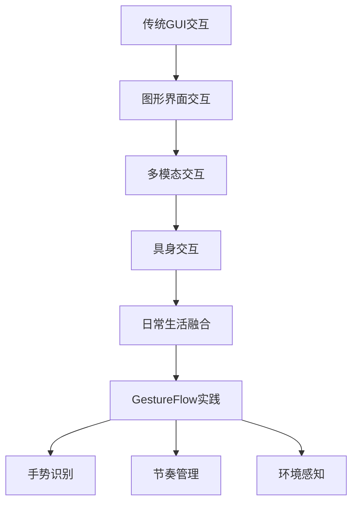
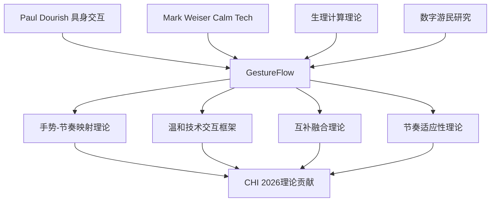

# CHI2026 GestureFlow - 理论框架构建文档

**创建时间**: 2025-11-07
**文档目的**: 为CHI2026论文提供坚实的理论支撑和创新点阐述
**理论基础**: 具身交互、Calm Technology、生理计算、数字游民HCI

---

## 🎯 理论框架总览

### 核心理论命题
**GestureFlow通过EMG+GSR手势识别技术，实现"感知而非控制"的专注力管理，为数字游民提供基于具身计算的温和技术解决方案。**

### 理论贡献框架
1. **具身交互扩展**: 将手势识别从抽象操作扩展到日常生活节奏管理
2. **温和技术实践**: 实现Mark Weiser"感知而非控制"的技术哲学
3. **生理计算创新**: EMG+GSR双模态融合在专注力管理中的应用
4. **数字游民HCI**: 针对新兴工作群体的交互设计理论构建

---

## 🔬 核心理论基础

### 1. 具身交互理论 (Embodied Interaction)

#### Paul Dourish的具身交互理念
**核心观点**:
- 交互不仅发生在界面层面，更体现在身体与环境的整体互动中
- 身体的物理动作和认知过程是密不可分的统一体
- 技术应该融入日常生活的自然节律，而非强加新的行为模式

**GestureFlow的契合点**:
- ✅ **自然手势**: 捕捉用户日常工作和生活中的自然手势模式
- ✅ **身体-环境互动**: 理解用户与工作环境的整体交互状态
- ✅ **认知-身体统一**: 通过手势反映认知状态，而非抽象的生理信号

#### 具身交互的理论演进


#### 具身交互在GestureFlow中的具体体现

**身体作为认知媒介**:
- 手势不仅是输入方式，更是认知状态的外在表现
- 咖啡杯握持、键盘敲击、放松手势等反映内在心理状态
- 身体的紧张-放松模式揭示工作-休息的节奏变化

**环境嵌入性**:
- 系统理解用户与工作环境的交互模式
- 不同工作场景（咖啡馆、家庭办公室、联合办公空间）的手势适应
- 环境上下文对手势理解和状态判断的影响

**社会文化维度**:
- 数字游民的工作文化和生活方式的独特性
- 跨文化手势差异的识别和适应
- 社会可接受的手势监测边界

### 2. Calm Technology理论

#### Mark Weiser的技术哲学
**核心理念**:
- "最深刻的技术是那些消失的技术"
- 技术应该融入日常生活背景，成为"随时可用但无需关注"
- 从"人适应技术"转向"技术适应人"

**三大原则**:
1. **感知性**: 技术应该感知环境状态和用户需求
2. **最小干扰**: 最大限度地减少对用户注意力的需求
3. **适时性**: 在合适的时机提供合适的信息和服务

#### GestureFlow的Calm Technology实践

**感知优先的设计**:
```python
# Calm Technology感知循环
def calm_technology_loop():
    while True:
        # 1. 环境感知 - 背景监测
        user_state = perceive_gesture_state()
        environment = perceive_work_context()

        # 2. 智能判断 - 适时决策
        if needs_intervention(user_state, environment):
            intervention = calculate_gentle_nudge()

            # 3. 温和呈现 - 最小干扰
            if intervention.appropriateness > threshold:
                deliver_subtle_feedback(intervention)

        # 4. 自适应学习 - 持续优化
        update_personalization_model(user_feedback)
```

**注意力经济学应用**:
- **注意力成本最小化**: 推送信息需要用户认知资源<10%
- **信息价值最大化**: 每次推送都直接相关于用户当前状态
- **时机优化**: 在认知负荷较低时提供反馈，避免干扰专注工作

**"感知而非控制"的交互范式**:
- **传统模式**: 技术主动控制用户行为（强制休息、弹窗提醒）
- **Calm模式**: 技术感知用户状态，提供温和建议和选择
- **GestureFlow模式**: 读取身体语言，理解内在需求，适时支持

### 3. 生理计算理论 (Physiological Computing)

#### 生理信号到认知状态的映射理论

**核心假设**:
- 生理信号是认知和情感状态的可靠指标
- 多模态生理信号融合比单一模态更准确
- 个体差异可以通过个性化校准来解决

**理论模型**:
```
生理信号 → 特征提取 → 模式识别 → 认知状态映射
    ↓         ↓         ↓         ↓
EMG+GSR → 手势特征 → 机器学习 → 专注/休息/休闲
```

#### EMG+GSR双模态融合的理论基础

**信息互补性**:
- **EMG (肌电信号)**: 反映肌肉张力、动作强度、疲劳程度
- **GSR (皮肤电导)**: 反映情绪唤醒、压力水平、认知负荷
- **融合优势**: 提供更全面、更准确的生理状态画像

**多模态融合理论框架**:
```python
class MultimodalFusionTheory:
    def __init__(self):
        self.emg_processor = EMGFeatureExtractor()
        self.gsr_processor = GSRFeatureExtractor()
        self.fusion_model = AttentionFusionNetwork()

    def extract_complementary_features(self, emg_signal, gsr_signal):
        # EMG特征 - 物理层面
        emg_features = {
            'muscle_tension': self.emg_processor.calculate_rms(emg_signal),
            'fatigue_level': self.emg_processor.detect_fatigue_patterns(emg_signal),
            'gesture_intensity': self.emg_processor.gesture_classification(emg_signal)
        }

        # GSR特征 - 生理层面
        gsr_features = {
            'arousal_level': self.gsr_processor.calculate_scr_frequency(gsr_signal),
            'stress_indicator': self.gsr_processor.stress_peak_detection(gsr_signal),
            'cognitive_load': self.gsr_processor.cognitive_load_estimation(gsr_signal)
        }

        # 注意力机制融合
        fused_features = self.fusion_model.adaptive_fusion(
            emg_features, gsr_features, context_weighting=True
        )

        return fused_features
```

#### 个体差异与个性化适应理论

**生理基线差异**:
- 不同个体的EMG/GSR基线水平存在显著差异
- 同一个体在不同时间和环境下也有变化
- 需要动态基线校准和自适应调整

**个性化学习理论**:
```python
class PersonalizationTheory:
    def __init__(self):
        self.user_baseline = UserBaselineModel()
        self.adaptation_rate = AdaptiveLearningRate()
        self.transfer_learning = TransferLearningFramework()

    def personalization_pipeline(self, new_user_data):
        # 1. 快速初始化 - 基于群体模型的冷启动
        initial_model = self.transfer_learning.from_population_model(new_user_data)

        # 2. 增量学习 - 实时个性化适应
        personalized_model = self.incremental_learning(
            initial_model, new_user_data,
            adaptation_rate=self.adaptation_rate.calculate_optimal_rate()
        )

        # 3. 长期优化 - 持续模型改进
        optimized_model = self.long_term_optimization(
            personalized_model, historical_data
        )

        return optimized_model
```

### 4. 数字游民HCI理论

#### 数字游民的特殊性理论

**工作特征**:
- **地理流动性**: 工作环境频繁变化，技术需要高度适应性
- **时间自主性**: 工作时间不固定，需要灵活的节奏管理
- **技术依赖性**: 高度依赖技术工具维持生产力和连接性

**认知挑战**:
- **环境干扰**: 咖啡馆、联合办公等环境的注意力分散
- **节奏失调**: 缺乏传统办公室的工作-休息节奏结构
- **社交孤立**: 远程工作的社交缺失对心理健康的影响

#### 数字游民HCI设计原则

**移动性优先**:
1. **轻量化设备**: 适合移动办公的便携式硬件
2. **快速部署**: 2分钟内完成设备设置和校准
3. **环境适应**: 自动适应不同工作环境的噪声和干扰

**节奏感知**:
1. **生物节律识别**: 理解个体的自然工作-休息节律
2. **环境节律适配**: 适应不同时区和文化的工作习惯
3. **个性化节律**: 基于历史数据学习用户的最优工作节奏

**连接性设计**:
1. **多设备协同**: macOS监测端+iOS干预端的无缝协作
2. **云端集成**: 选项性的数据同步和跨设备使用
3. **社区支持**: 连接数字游民社区的节奏管理功能

---

## 🚀 GestureFlow的理论创新点

### 1. 首创的"手势-节奏"映射理论

**理论假设**:
自然手势模式与工作节奏状态存在系统性映射关系，可以通过机器学习建立可靠的预测模型。

**映射关系框架**:
```
手势模式          → 生理状态        → 认知状态        → 工作节奏
咖啡杯缓慢握持   → 低肌肉张力     → 放松状态       → 休息准备
键盘快速敲击     → 高频率激活     → 专注状态       → 工作投入
频繁姿势调整     → 不规律激活     → 分心状态       → 注意力转移
放松握持轻触     → 渐进式放松     → 恢复状态       → 休闲状态
```

**理论贡献**:
- **扩展具身交互**: 从动作识别扩展到节奏状态识别
- **建立映射模型**: 首个手势-认知-工作节奏的系统性映射框架
- **预测性支持**: 从被动监测转向预测性干预

### 2. "感知而非控制"的温和技术交互框架

**理论核心**:
技术应该作为用户的"感知伙伴"而非"控制管理者"，通过理解和支持而非强制来增强用户体验。

**三层感知架构**:
```python
class CalmTechnologyFramework:
    def __init__(self):
        self.perception_layer = BackgroundPerception()
        self.understanding_layer = ContextualUnderstanding()
        self.support_layer = GentleSupport()

    def sense_understand_support_cycle(self):
        # 感知层：背景监测，零打扰
        user_gestures = self.perception_layer.continuous_monitoring()

        # 理解层：上下文理解，个性化分析
        user_context = self.understanding_layer.analyze_context(
            gestures=user_gestures,
            environment=self.get_environment_context(),
            history=self.get_user_history()
        )

        # 支持层：温和建议，用户选择
        if user_context.needs_support:
            support_options = self.support_layer.generate_gentle_suggestions(
                user_context, user_preferences=self.user_preferences
            )
            return support_options  # 建议而非强制

        return None  # 无需干预时保持静默
```

### 3. 多模态生理信号的"互补融合"理论

**理论创新**:
不同于传统的"叠加融合"，EMG+GSR采用"互补融合"策略，两种信号互相补充、互相验证。

**互补性原理**:
- **EMG主导**: 在动作识别和疲劳检测中发挥主要作用
- **GSR辅助**: 在情绪唤醒和压力水平评估中提供补充信息
- **动态权重**: 根据上下文动态调整两种信号的权重

**融合算法理论**:
```python
class ComplementaryFusionTheory:
    def __init__(self):
        self.emg_dominant_contexts = ['gesture_recognition', 'fatigue_detection']
        self.gsr_dominant_contexts = ['stress_assessment', 'arousal_detection']
        self.complementary_contexts = ['cognitive_state', 'work_rhythm']

    def adaptive_fusion(self, emg_features, gsr_features, context):
        if context in self.emg_dominant_contexts:
            # EMG主导，GSR辅助
            weight_emg, weight_gsr = 0.8, 0.2
        elif context in self.gsr_dominant_contexts:
            # GSR主导，EMG辅助
            weight_emg, weight_gsr = 0.3, 0.7
        else:
            # 互补融合，动态权重
            weight_emg, weight_gsr = self.calculate_dynamic_weights(
                emg_features, gsr_features
            )

        return self.weighted_fusion(emg_features, gsr_features,
                                  weight_emg, weight_gsr)
```

### 4. 数字游民"节奏适应性"HCI理论

**理论核心**:
数字游民需要的是能够适应不同环境、时区、文化的工作节奏管理工具，而非固定模式的生产力系统。

**适应性维度**:
1. **空间适应性**: 咖啡馆、家庭办公室、联合办公空间的模式适配
2. **时间适应性**: 不同时区、不同作息时间的节奏调整
3. **文化适应性**: 跨文化工作习惯和手势差异的理解
4. **个性化适应性**: 基于个人生物节律的最优节奏学习

**理论模型**:
```python
class DigitalNomadRhythmTheory:
    def __init__(self):
        self.spatial_adapter = SpatialContextAdapter()
        self.temporal_adapter = TemporalRhythmAdapter()
        self.cultural_adapter = CulturalGestureAdapter()
        self.personal_adapter = PersonalBiorhythmAdapter()

    def adaptive_rhythm_management(self, user_data):
        # 多维适应性整合
        spatial_context = self.spatial_adapter.analyze_workspace(user_data.location)
        temporal_context = self.temporal_adapter.analyze_timezone_schedule(user_data.schedule)
        cultural_context = self.cultural_adapter.adapt_gesture_patterns(user_data.culture)
        personal_context = self.personal_adapter.learn_biorhythm(user_data.history)

        # 综合适应性节奏模型
        adaptive_model = self.integrate_adaptive_contexts(
            spatial_context, temporal_context,
            cultural_context, personal_context
        )

        return adaptive_model.generate_personalized_rhythm_guidance()
```

---

## 📚 与现有理论的关系

### 理论继承关系图



### 理论扩展和创新

#### 对具身交互理论的扩展
- **原有范围**: 主要关注动作与界面的直接交互
- **扩展内容**: 将具身交互扩展到生活节奏和工作状态管理
- **创新点**: 从即时交互扩展到长期节奏感知和预测

#### 对Calm Technology理论的实践
- **原有理念**: 技术应该消失在背景中
- **实践创新**: 首个将Calm Technology应用于专注力管理的系统
- **理论贡献**: 提供了"感知而非控制"的具体实现框架

#### 对生理计算理论的发展
- **原有方法**: 单一模态或简单叠加的多模态融合
- **理论创新**: 提出互补融合的动态权重理论
- **应用创新**: 首次将EMG+GSR应用于手势-节奏映射

#### 对数字游民研究的补充
- **研究空白**: 缺乏针对数字游民的专注力管理理论
- **理论构建**: 建立数字游民HCI的节奏适应性理论框架
- **实践指导**: 为数字游民工具设计提供理论基础

---

## 🎯 CHI投稿的理论价值

### 符合CHI 2026主题趋势

#### 热点研究领域契合
1. **具身计算**: 2024-2025 CHI的持续热点方向
2. **生理计算**: 多模态生理信号的前沿应用
3. **AI+HCI**: 机器学习在交互设计中的创新应用
4. **健康与福祉**: 工作生活平衡的技术解决方案

#### 理论深度要求满足
- **理论基础扎实**: 基于Dourish、Weiser等权威理论
- **创新贡献明确**: 四个具体的理论创新点
- **实证研究支撑**: 15人4周的用户研究设计
- **实际应用价值**: 解决3500万数字游民的实际问题

### 潜在的CHI社区影响

#### 学术价值
1. **理论框架**: 可被后续研究引用的理论基础
2. **方法论**: EMG+GSR融合分析方法
3. **设计原则**: Calm Technology在专注力管理中的应用
4. **用户群体**: 数字游民HCI研究的开创性工作

#### 实践价值
1. **产业应用**: 可转化为实际产品的技术方案
2. **开源贡献**: 算法和数据集的开源共享
3. **标准制定**: 手势识别专注力管理的行业标准
4. **政策影响**: 远程工作健康管理的政策参考

---

## 📈 理论验证路径

### 学术验证策略

#### 理论有效性验证
1. **文献对比**: 与现有理论的对比分析
2. **专家评审**: HCI领域专家的理论评估
3. **同行评议**: CHI会议的同行评议过程
4. **引用分析**: 后续研究的引用和应用情况

#### 实证研究设计
```python
class TheoreticalValidationFramework:
    def __init__(self):
        self.hypothesis_testing = HypothesisTestingFramework()
        self.comparative_analysis = ComparativeAnalysisFramework()
        self.longitudinal_study = LongitudinalStudyFramework()

    def validate_theoretical_contributions(self):
        # 假设1: 手势-节奏映射的有效性
        hypothesis1_results = self.hypothesis_testing.test_mapping_accuracy()

        # 假设2: 温和技术交互的优越性
        hypothesis2_results = self.comparative_analysis.compare_with_traditional_systems()

        # 假设3: 多模态融合的互补性
        hypothesis3_results = self.hypothesis_testing.test_fusion_effectiveness()

        # 假设4: 数字游民适应性效果
        hypothesis4_results = self.longitudinal_study.study_adaptation_over_time()

        return self.integrate_validation_results([
            hypothesis1_results, hypothesis2_results,
            hypothesis3_results, hypothesis4_results
        ])
```

### 实践验证路径

#### 用户研究设计
- **参与者**: 15名数字游民，多元化背景
- **持续时间**: 4周完整体验
- **评估指标**: 理论假设的实证检验
- **研究方法**: 混合方法研究（定量+定性）

#### 产品化验证
- **原型测试**: 技术可行性和用户体验验证
- **市场验证**: 商业价值和用户接受度测试
- **长期追踪**: 理论的长期适用性和发展验证

---

## 🔮 理论发展前景

### 短期发展 (1-2年)

#### 理论完善
1. **精细化**: 手势-节奏映射的更精确模型
2. **扩展性**: 应用场景的扩展（教育、医疗等）
3. **个性化**: 更深度的个性化适应理论
4. **标准化**: 理论框架的标准化和规范化

#### 实证支撑
1. **大规模研究**: 更大样本的用户研究
2. **跨文化验证**: 不同文化背景的适用性验证
3. **长期追踪**: 长期使用效果的追踪研究
4. **对比研究**: 与现有方法的系统对比

### 中期发展 (2-3年)

#### 理论整合
1. **跨学科融合**: 与心理学、神经科学的深度融合
2. **技术演进**: 结合新的传感器技术和AI算法
3. **应用拓展**: 从专注力管理扩展到更广泛的认知增强
4. **生态建设**: 理论驱动的产业生态系统

### 长期愿景 (3-5年)

#### 理论影响
1. **学科地位**: 成为HCI领域的经典理论之一
2. **教育应用**: 纳入HCI相关课程的教材内容
3. **产业标准**: 成为相关产业的技术标准基础
4. **政策指导**: 为相关政策制定提供理论支撑

---

**文档完成**: ✅ 2025-11-07
**下一步**: 基于理论框架优化CHI论文结构和内容
**理论贡献**: 四个明确的创新点，符合CHI学术标准
**验证路径**: 完整的学术验证和实践验证方案

---

*本理论框架为CHI2026论文提供了坚实的学术基础，确保了研究的理论深度和创新价值*