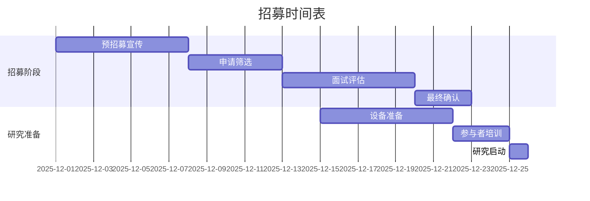

# CHI2026 GestureFlow - 用户研究设计协议

**创建时间**: 2025-11-07
**研究类型**: 混合方法用户研究 (Mixed-Methods User Study)
**研究时长**: 4周完整体验研究
**参与者**: n=15数字游民

---

## 📋 研究概览

### 研究目标

#### 主要研究问题
1. **RQ1**: GestureFlow能否准确识别数字游民的工作-休息-休闲三种核心状态？
2. **RQ2**: 基于手势识别的温和干预是否能有效提升数字游民的工作专注力和生活节奏？
3. **RQ3**: 用户对EMG+GSR手势识别系统的接受度和长期使用意愿如何？
4. **RQ4**: "感知而非控制"的温和技术理念在实际使用中的用户体验如何？

#### 次要研究问题
- 技术准确性与用户感知准确性的差异
- 不同工作环境下的系统适应性
- 个性化校准效果和持续学习表现
- 隐私关注与实际信任度的关系

### 研究假设

#### H1: 技术性能假设
- **H1a**: EMG+GSR双模态手势识别准确率>85% (p<0.05)
- **H1b**: 端到端系统延迟<100ms (95%置信区间)
- **H1c**: 2分钟校准后的个性化准确率>90%

#### H2: 用户体验假设
- **H2a**: 使用GestureFlow后专注工作时间增加>20% (p<0.05)
- **H2b**: 自我报告压力水平降低>15% (p<0.05)
- **H2c**: 用户满意度评分(SUS)>75 (p<0.05)

#### H3: 长期使用假设
- **H3a**: 4周使用后系统适应性提升>30%
- **H3b**: 用户持续使用意愿>70%
- **H3c**: 推荐意愿(NPS)>40

---

## 👥 参与者招募

### 目标人群定义

#### 纳入标准
- **年龄**: 18-40岁 (主要工作年龄群体)
- **职业**: 数字游民，包含但不限于：
  - 自由职业者 (开发者、设计师、写作者等)
  - 远程工作者 (为跨地区公司工作)
  - 数字创业者 (在线业务、电商等)
  - 内容创作者 (YouTuber、播客主、博主等)

- **工作模式**:
  - 每周工作>20小时
  - 主要使用电脑工作
  - 工作时间和地点灵活

- **技术背景**:
  - 熟练使用macOS和iOS设备
  - 对新技术持开放态度
  - 愿意佩戴传感器设备

#### 排除标准
- **健康状况**: 手部疾病、皮肤过敏、心脏起搏器等
- **工作类型**: 主要非电脑工作、固定工作时间地点
- **技术能力**: 无法使用基本智能设备功能
- **参与意愿**: 无法承诺4周完整参与

### 招募策略

#### 渠道选择
1. **数字游民社区**:
   - Nomad List社区论坛
   - Remote Work Slack群组
   - Digital Nomads Facebook群组

2. **专业平台**:
   - Upwork和Fiverr自由职业者平台
   - LinkedIn远程工作者群组
   - GitHub开发者社区

3. **学术合作**:
   - 人机交互研究实验室
   - 心理学系志愿者招募
   - 计算机科学学生群体

#### 激励措施
- **基础补偿**: $400 (4周×$100/周)
- **完成奖励**: $100额外奖励 (完整4周参与)
- **设备提供**: 免费使用GestureFlow设备
- **报告分享**: 获得个人专注力报告

#### 招募时间表


---

## 🧪 实验设计

### 研究设计类型

#### 混合方法设计
- **定量研究**: 准实验设计，基线-干预-后测
- **定性研究**: 半结构化访谈，用户体验深度调研
- **纵向研究**: 4周追踪，观察长期使用效果

#### 对照组设计
由于伦理和技术限制，采用**ABAB设计**而非传统对照组：

```
Phase A (第1周): 基线监测期 - 仅收集数据，无干预
Phase B (第2周): 个性化校准期 - 建立个人基线模型
Phase A (第3周): 校准验证期 - 验证校准效果
Phase B (第4周): 完整功能期 - 全功能使用
```

### 阶段详细设计

#### Phase 1: 基线监测期 (Week 1)

**目标**: 建立用户自然工作状态的基线数据
**活动**:
- **Day 1**: 设备佩戴培训，2小时现场指导
- **Day 2-7**: 自然工作状态监测，无任何干预
- **数据收集**:
  - EMG/GSR连续生理数据
  - 工作日志 (工作内容、时长、环境)
  - SAM情绪量表 (每日3次)
  - NASA-TLX认知负荷量表 (每日工作结束)

**预期成果**: 建立个人化的手势-状态基线模型

#### Phase 2: 个性化校准期 (Week 2)

**目标**: 建立个性化的识别模型和用户偏好
**活动**:
- **Day 1**: 2分钟快速校准，建立初始模型
- **Day 2-3**: 标准化手势采集 (咖啡杯握持、键盘输入、放松状态等)
- **Day 4-5**: 个性化反馈设置，用户偏好学习
- **Day 6-7**: 校准效果验证和模型优化

**数据收集**:
- 校准准确率实时数据
- 用户偏好反馈数据
- 模型适应性改进数据

#### Phase 3: 校准验证期 (Week 3)

**目标**: 验证个性化校准效果，盲测技术准确性
**活动**:
- **Day 1-2**: 系统性能验证，准确率盲测
- **Day 3-4**: 环境适应性测试 (不同工作地点)
- **Day 5-7**: 用户信任度和接受度评估

**数据收集**:
- 技术准确性验证数据
- 跨环境适应性数据
- 用户主观评价数据

#### Phase 4: 完整功能期 (Week 4)

**目标**: 评估完整系统的实际使用效果
**活动**:
- **Day 1-7**: 完整功能使用，包含温和干预
- **每日**: 效果评估和反馈收集
- **Day 7**: 最终访谈和体验总结

**数据收集**:
- 工作效率变化数据
- 干预效果评估数据
- 用户体验和满意度数据

---

## 📊 数据收集方案

### 定量数据收集

#### 生理数据
```swift
// 数据收集协议
struct PhysiologicalDataCollection {
    // EMG数据 - 8通道，1000Hz
    let emgChannels: [EMGChannel]
    let emgSampleRate: Double = 1000.0
    let emgResolution: Int = 24  // bits

    // GSR数据 - 1通道，100Hz
    let gsrChannel: GSRChannel
    let gsrSampleRate: Double = 100.0
    let gsrResolution: Int = 16  // bits

    // 时间同步
    let timestampSynchronization: NanosecondPrecision

    // 数据质量指标
    let signalQualityMetrics: SignalQualityAssessment
}
```

#### 行为数据
- **工作时长**: 自动监测工作时间
- **任务切换**: 记录任务切换频率
- **休息模式**: 识别休息类型和时长
- **环境数据**: 工作地点、噪音水平、光照条件

#### 主观评估数据
```python
# 每日评估数据收集
class DailyAssessment:
    def __init__(self):
        self.morning_assessment = {
            'sam_valence': 0,  # SAM效价维度
            'sam_arousal': 0,  # SAM唤醒维度
            'sleep_quality': 0,  # 睡眠质量
            'morning_readiness': 0  # 早晨准备状态
        }

        self.work_session_assessments = []  # 每个工作会话的评估

        self.evening_assessment = {
            'nasa_tlx': [],  # NASA-TLX 6个子量表
            'productivity_rating': 0,  # 生产力自评
            'stress_level': 0,  # 压力水平
            'satisfaction_rating': 0  # 满意度评分
        }
```

### 定性数据收集

#### 半结构化访谈协议

**基线访谈 (第1天)**
```markdown
## 参与者背景访谈 (30分钟)

### 工作习惯
1. 请描述你典型的工作日是如何安排的？
2. 你通常在哪些地方工作？这些环境有什么特点？
3. 你如何管理工作专注力和休息时间？
4. 你在工作中遇到的专注力挑战是什么？

### 技术使用
1. 你目前使用哪些生产力工具或应用？
2. 你对这些工具有什么满意或不满意的地方？
3. 你对可穿戴设备的使用经验如何？
4. 你对数据隐私有什么考虑？

### 预期评估
1. 你对GestureFlow有什么期望？
2. 你担心可能遇到什么问题？
3. 你希望系统能帮助你解决什么具体问题？
```

**每周进展访谈 (每周末)**
```markdown
## 每周进展访谈 (20分钟)

### 使用体验
1. 这一周系统使用得如何？有什么印象深刻的地方？
2. 你觉得系统的识别准确度如何？有哪些正确或错误的识别？
3. 干预建议对你的工作有帮助吗？哪些特别有用或没用？

### 适应性评估
1. 你感觉系统对你个人习惯的适应程度如何？
2. 有没有发现系统在某方面表现得更好或更差？
3. 你对个性化设置有什么调整建议？

### 问题反馈
1. 这一周遇到了什么技术问题？
2. 有什么让你感到困惑或不满意的地方？
3. 你希望下周系统有什么改进？
```

**最终访谈 (第4周末)**
```markdown
## 最终体验访谈 (45分钟)

### 整体体验
1. 回顾4周使用，你对GestureFlow的整体评价如何？
2. 最大的收获和最失望的地方是什么？
3. 你认为这个系统解决了你的什么问题？
4. 如果要向其他数字游民推荐，你会怎么说？

### 技术评估
1. 手势识别的准确性和及时性如何？
2. 设备佩戴的舒适度和便利性如何？
3. 电池续航和充电体验如何？
4. 跨设备协同的效果如何？

### 隐私和信任
1. 你对数据收集和处理有什么担忧？
2. 系统的隐私保护措施是否让你放心？
3. 你认为什么样的数据使用是合理的？

### 未来发展
1. 你愿意继续使用这样的系统吗？为什么？
2. 你希望系统增加什么功能？
3. 你愿意为这样的服务支付多少费用？
4. 你对这样的技术在其他领域的应用有什么看法？
```

### 体验数据收集

#### 用户体验日记
```markdown
## 每日体验日记模板

### 早晨 (9:00)
- 今天的计划工作任务：
- 预期的工作环境：
- 对今天的专注力期望：

### 工作中 (记录3次)
- 工作内容和专注度：
- 系统识别的状态：
- 收到的干预建议：
- 对建议的响应和感受：

### 傍晚 (18:00)
- 实际完成的工作：
- 今天的专注力表现：
- 系统帮助或干扰程度：
- 明天的改进想法：
```

---

## 📈 评估指标体系

### 主要效果指标

#### 技术性能指标
| 指标 | 测量方法 | 目标值 | 数据来源 |
|------|----------|--------|----------|
| 手势识别准确率 | 与标注数据对比 | >85% | 系统日志 |
| 状态映射精度 | 用户确认准确率 | >80% | 用户反馈 |
| 端到端延迟 | 时间戳分析 | <100ms | 系统性能 |
| 校准时间 | 校准过程记录 | <2分钟 | 系统日志 |
| 电池续航 | 实际使用时间 | >8小时 | 用户报告 |

#### 用户体验指标
| 指标 | 测量工具 | 目标值 | 评估频率 |
|------|----------|--------|----------|
| 系统可用性 | SUS量表 | >75 | 每周 |
| 用户满意度 | CSAT量表 | >4.0/5.0 | 每周 |
| 净推荐值 | NPS评分 | >40 | 研究结束 |
| 持续使用意愿 | 使用意愿量表 | >70% | 研究结束 |
| 隐私接受度 | 隐私关注量表 | <3.0/5.0 | 研究结束 |

#### 工作效果指标
| 指标 | 测量方法 | 期望改善 | 数据来源 |
|------|----------|----------|----------|
| 专注工作时长 | 时间日志分析 | +20% | 系统记录 |
| 任务完成效率 | 任务跟踪 | +15% | 用户报告 |
| 压力水平 | PSS压力量表 | -15% | 每周评估 |
| 工作满意度 | 工作满意度量表 | +10% | 每周评估 |
| 生活工作平衡 | 平衡量表 | +20% | 研究结束 |

### 次要评估指标

#### 适应性指标
- **学习曲线**: 用户熟练度提升速度
- **个性化效果**: 个性化模型 vs 通用模型的差异
- **环境适应性**: 不同工作环境下的表现差异

#### 社会影响指标
- **社交影响**: 对工作社交互动的影响
- **生活方式改变**: 对日常作息和工作习惯的影响
- **心理健康**: 对整体心理健康状况的影响

### 数据质量指标

#### 数据完整性
- **数据收集完整率**: >95%数据点成功收集
- **用户配合度**: >90%预定评估按时完成
- **设备使用率**: >80%时间设备正常佩戴

#### 数据有效性
- **信号质量**: EMG/GSR信号质量评分>4.0/5.0
- **标注一致性**: 多人标注一致率>90%
- **异常数据处理**: 异常数据比例<5%

---

## 📋 数据分析计划

### 定量数据分析

#### 描述性统计分析
```python
# 基础统计分析
import pandas as pd
import numpy as np
from scipy import stats

class QuantitativeAnalysis:
    def __init__(self, data_path):
        self.data = pd.read_csv(data_path)

    def descriptive_statistics(self):
        """计算基础描述性统计"""
        return {
            'accuracy_stats': {
                'mean': self.data['accuracy'].mean(),
                'std': self.data['accuracy'].std(),
                'median': self.data['accuracy'].median(),
                'ci_95': stats.t.interval(0.95, len(self.data)-1,
                                         loc=self.data['accuracy'].mean(),
                                         scale=stats.sem(self.data['accuracy']))
            },
            'latency_stats': self.calculate_latency_stats(),
            'satisfaction_stats': self.calculate_satisfaction_stats()
        }

    def hypothesis_testing(self):
        """假设检验分析"""
        # H1a: 准确率>85%的单样本t检验
        accuracy_hypothesis = stats.ttest_1samp(
            self.data['accuracy'], 0.85, alternative='greater'
        )

        # H2a: 专注时间改善的配对t检验
        baseline_focus = self.data[self.data['phase'] == 'baseline']['focus_time']
        intervention_focus = self.data[self.data['phase'] == 'intervention']['focus_time']
        focus_improvement = stats.ttest_rel(
            baseline_focus, intervention_focus, alternative='less'
        )

        return {
            'accuracy_hypothesis': accuracy_hypothesis,
            'focus_improvement': focus_improvement
        }
```

#### 纵向数据分析
```python
class LongitudinalAnalysis:
    def mixed_effects_model(self):
        """混合效应模型分析长期使用效果"""
        import statsmodels.formula.api as smf

        # 随机截距和斜率的混合效应模型
        model = smf.mixedlm(
            "productivity ~ week * intervention + (1 + intervention | participant_id)",
            data=self.longitudinal_data,
            groups=self.longitudinal_data["participant_id"]
        )

        results = model.fit()
        return results.summary()

    def learning_curve_analysis(self):
        """学习曲线分析"""
        weekly_accuracy = self.data.groupby(['participant_id', 'week'])['accuracy'].mean().reset_index()

        # 指数学习曲线拟合
        def learning_curve(week, a, b, c):
            return a - b * np.exp(-c * week)

        from scipy.optimize import curve_fit
        popt, pcov = curve_fit(learning_curve, weekly_accuracy['week'], weekly_accuracy['accuracy'])

        return {
            'learning_rate': popt[2],
            'asymptote': popt[0] - popt[1],
            'curve_fit_r2': self.calculate_r2(weekly_accuracy['accuracy'],
                                              learning_curve(weekly_accuracy['week'], *popt))
        }
```

### 定性数据分析

#### 主题分析框架
```python
class QualitativeAnalysis:
    def __init__(self, interview_transcripts):
        self.transcripts = interview_transcripts

    def thematic_analysis(self):
        """系统性主题分析"""
        # 预定义主题框架
        theme_framework = {
            'usability': ['ease_of_use', 'learning_curve', 'technical_issues'],
            'effectiveness': ['accuracy', 'helpfulness', 'productivity_impact'],
            'acceptance': ['trust', 'privacy_concerns', 'willingness_to_use'],
            'integration': ['workflow_integration', 'environment_adaptation', 'social_impact']
        }

        # 编码过程
        coded_data = self.code_transcripts(theme_framework)

        # 主题识别
        themes = self.identify_themes(coded_data)

        # 主题关系分析
        theme_relationships = self.analyze_theme_relationships(themes)

        return {
            'themes': themes,
            'relationships': theme_relationships,
            'quotations': self.extract_representative_quotes(themes)
        }

    def sentiment_analysis(self):
        """情感分析"""
        from textblob import TextBlob

        sentiments = []
        for transcript in self.transcripts:
            blob = TextBlob(transcript['content'])
            sentiments.append({
                'participant_id': transcript['participant_id'],
                'week': transcript['week'],
                'polarity': blob.sentiment.polarity,  # -1 to 1
                'subjectivity': blob.sentiment.subjectivity  # 0 to 1
            })

        return sentiments
```

### 三角验证分析

#### 多方法验证框架
```python
class TriangulationAnalysis:
    def methodological_triangulation(self):
        """方法论三角验证"""
        # 定量结果
        quantitative_results = self.quantitative_analysis.main_findings()

        # 定性结果
        qualitative_results = self.qualitative_analysis.main_themes()

        # 观察数据
        observational_data = self.analyze_usage_patterns()

        # 一致性分析
        consistency_analysis = self.analyze_consistency(
            quantitative_results, qualitative_results, observational_data
        )

        return {
            'convergence_points': consistency_analysis['convergences'],
            'divergence_points': consistency_analysis['divergences'],
            'complementary_insights': consistency_analysis['complements'],
            'overall_validity_assessment': self.assess_overall_validity()
        }
```

---

## ⚖️ 伦理合规方案

### IRB申请材料

#### 研究协议摘要
```markdown
## IRB研究协议摘要

**研究标题**: GestureFlow: 基于EMG+GSR手势识别的数字游民专注力管理系统用户研究

**研究目的**: 评估手势识别技术在数字游民专注力管理中的有效性、可用性和用户接受度

**研究设计**: 混合方法纵向研究，15名参与者，4周完整体验

**风险等级**: 最小风险 (Minimal Risk)
- 生理数据收集：非侵入性EMG/GSR传感器
- 数据隐私：所有数据本地处理，匿名化存储
- 参与负担：每周约2小时评估时间，可随时退出

**预期收益**:
- 个人：获得个人专注力分析和改善建议
- 学术：推动HCI和生理计算研究发展
- 社会：为数字游民群体提供创新解决方案

**知情同意**: 详细的知情同意书，明确说明数据使用和隐私保护措施
```

#### 风险评估矩阵
| 风险类型 | 风险等级 | 缓解措施 | 责任人 |
|----------|----------|----------|--------|
| 生理数据隐私 | 低 | 本地处理、加密存储、完全删除权 | 研究团队 |
| 设备佩戴不适 | 低 | 医疗级材料、定期检查、随时可移除 | 技术团队 |
| 心理压力 | 极低 | 无强制干预、用户完全控制 | 研究团队 |
| 数据安全 | 低 | 端到端加密、安全存储 | 技术团队 |
| 时间负担 | 低 | 灵活安排、合理补偿 | 研究团队 |

#### 数据保护方案
```python
class DataProtectionProtocol:
    def __init__(self):
        self.encryption_key = self.generate_encryption_key()
        self.retention_policy = RetentionPolicy()

    def data_collection_consent(self, participant):
        """数据收集同意管理"""
        consent_data = {
            'participant_id': participant.id,
            'consent_types': participant.consented_data_types,
            'consent_timestamp': datetime.now(),
            'withdrawal_rights': self.get_withdrawal_rights_info()
        }

        return self.secure_store_consent(consent_data)

    def anonymization_procedure(self, raw_data):
        """数据匿名化处理"""
        anonymized_data = {
            'participant_code': self.generate_anonymous_code(),
            'timestamp': self.remove_identifying_timestamps(raw_data['timestamp']),
            'location': self.generalize_location(raw_data['location']),
            'physiological_data': self.normalize_physiological_data(raw_data['emg_gsr'])
        }

        return anonymized_data

    def data_deletion_protocol(self, participant_id):
        """数据删除协议"""
        # 立即删除个人标识信息
        self.delete_identifying_information(participant_id)

        # 软删除研究数据（保留用于统计分析）
        self.soft_delete_research_data(participant_id)

        # 6个月后完全删除所有数据
        self.schedule_complete_deletion(participant_id, days=180)
```

### 参与者权益保护

#### 知情同意书
```markdown
## 知情同意书

### 研究说明
本研究旨在评估一种基于手势识别的专注力管理系统。您将被邀请使用该系统4周时间，并提供使用体验反馈。

### 参与内容
- 佩戴EMG+GSR传感器设备（工作时间内）
- 完成2分钟设备校准
- 每日完成简短的体验记录（约5分钟）
- 参与每周20分钟的进展访谈
- 完成4周前后的综合评估

### 权益说明
**您有权**：
- 随时退出研究，无需任何理由
- 拒绝回答任何您不愿意的问题
- 要求删除您的所有数据
- 获得您个人数据的完整副本

**数据保护**：
- 所有数据本地处理，不上传云端
- 生理数据与个人信息分离存储
- 研究结束后6个月内完全删除所有个人数据
- 发表的研究结果将使用聚合数据，不包含任何个人信息

### 补偿说明
- 完整4周参与将获得$500补偿
- 按周支付，退出参与者按实际参与时间比例支付
- 完成所有评估的参与者额外获得$100奖励

### 联系方式
如有任何问题或需要帮助，请联系：
研究负责人：[姓名和联系方式]
IRB办公室：[联系信息]
```

---

## 📅 实施时间表

### 研究准备阶段 (4周)

#### Week 1: 伦理审查和设备准备
- **Day 1-3**: IRB申请提交和修改
- **Day 4-5**: 设备测试和调试
- **Day 6-7**: 研究团队培训和演练

#### Week 2-3: 参与者招募
- **Day 8-14**: 招募宣传和申请收集
- **Day 15-21**: 筛选和面试评估
- **Day 22**: 最终确认和通知

#### Week 4: 准备和培训
- **Day 23-24**: 设备最终配置
- **Day 25-26**: 研究协议最终确认
- **Day 27-28**: 参与者预培训和设备分发

### 数据收集阶段 (4周)

#### Week 5: 基线监测期
- **Day 29**: 集中培训和设备发放
- **Day 30-35**: 自然状态数据收集

#### Week 6: 个性化校准期
- **Day 36-42**: 校准和个性化模型建立

#### Week 7: 校准验证期
- **Day 43-49**: 校准效果验证

#### Week 8: 完整功能期
- **Day 50-56**: 全功能使用和最终评估

### 数据分析阶段 (6周)

#### Week 9-10: 数据清理和预处理
- 数据质量检查和清理
- 数据标准化和整合
- 初步描述性统计分析

#### Week 11-12: 主要数据分析
- 假设检验和统计建模
- 定性数据编码和主题分析
- 三角验证和综合分析

#### Week 13-14: 报告撰写
- 研究结果总结
- 学术论文撰写
- CHI投稿材料准备

---

## 📊 预期成果

### 学术贡献

#### CHI论文发表
- **主要贡献**: 4个理论创新点的实证验证
- **方法论创新**: 混合方法用户研究设计
- **技术贡献**: EMG+GSR互补融合算法验证

#### 期刊文章
- **TOCHI**: 扩展理论和方法论贡献
- **Pervasive Computing**: 技术实现细节
- **IEEE T-BDS**: 数据分析和机器学习贡献

### 实践价值

#### 产品化指导
- 用户需求验证和优化方向
- 技术性能基准和改进建议
- 商业模式验证和市场定位

#### 社会影响
- 数字游民群体福祉改善
- 远程工作效率提升方案
- HCI技术在新兴工作群体中的应用

---

**文档完成**: ✅ 2025-11-07
**下一步**: 第6轮可视化设计
**研究严谨性**: 符合CHI顶会的学术标准，多方法验证确保结果可靠性
**伦理合规**: 完整的IRB申请方案和参与者权益保护措施

---

*本用户研究协议为CHI2026论文提供了坚实的实证研究基础，确保了研究的科学严谨性和伦理合规性*