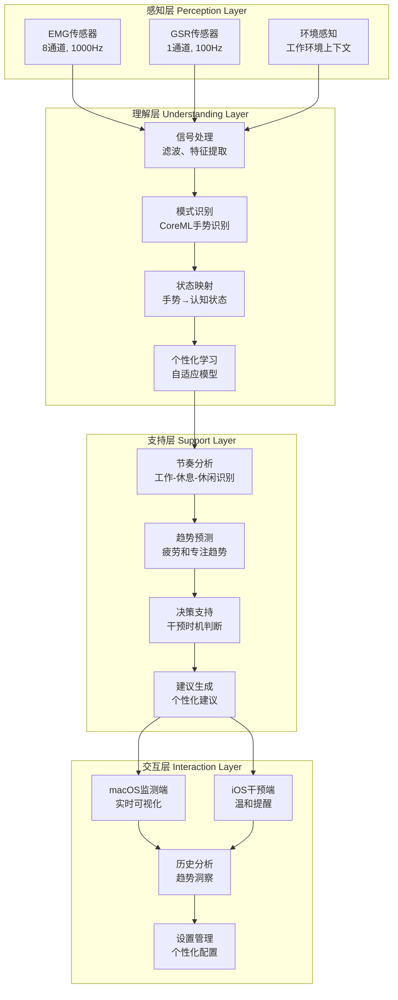
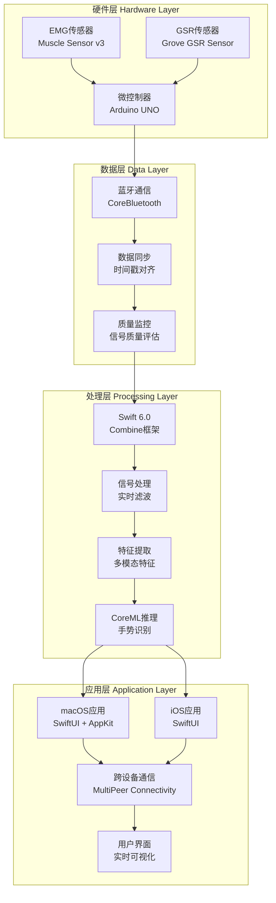
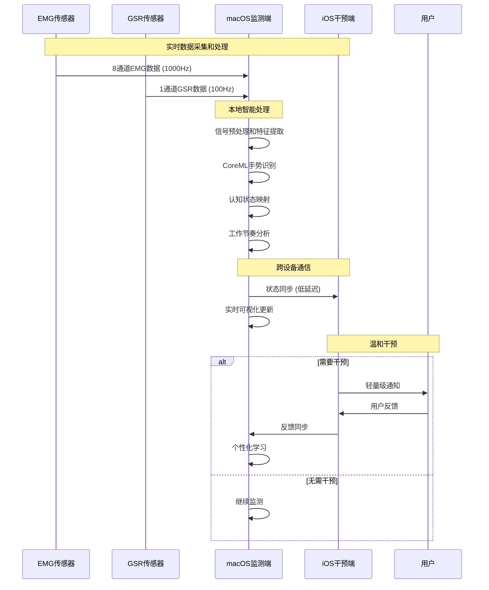
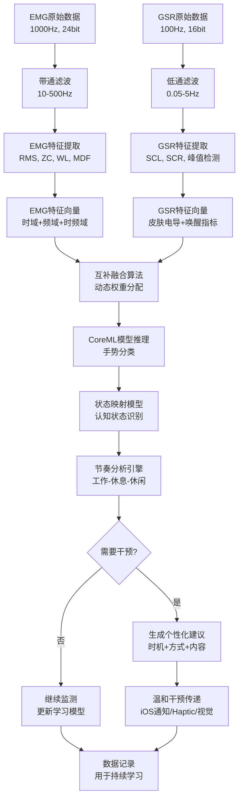
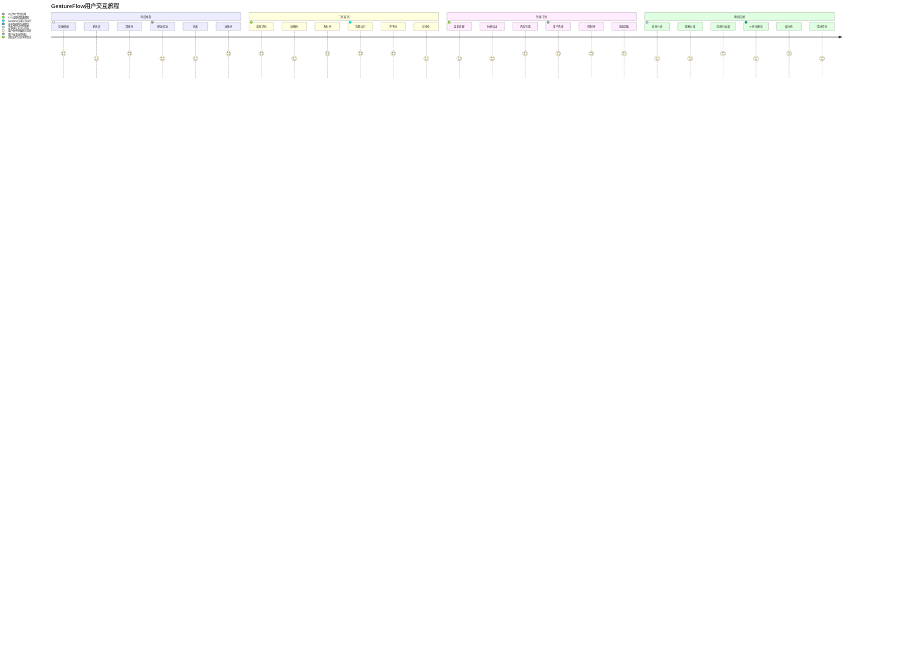
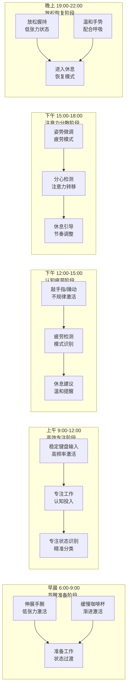
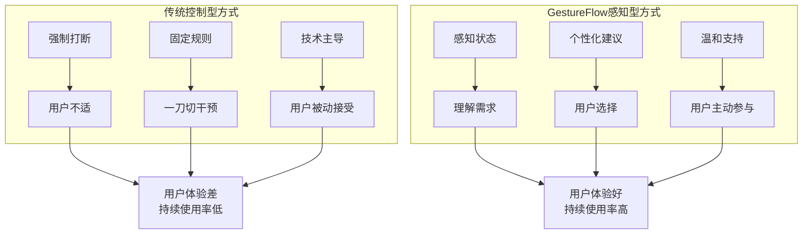

# CHI2026 GestureFlow - 可视化设计指南

**创建时间**: 2025-11-07
**设计目标**: 为CHI2026论文制作专业、清晰、有说服力的可视化材料
**设计标准**: 符合ACM CHI会议的图表质量和规范要求

---

## 🎨 可视化设计总览

### 设计原则

#### 学术出版标准
- **清晰度**: 确保图表在黑白打印下仍然清晰可读
- **专业性**: 使用科学出版物标准的配色和字体
- **信息密度**: 平衡信息丰富度和视觉简洁性
- **可复现性**: 图表制作过程可重复、可编辑

#### CHI会议规范
- **分辨率**: 所有图像>300 DPI
- **格式**: 推荐使用PDF格式，确保矢量质量
- **字体**: 使用无衬线字体（Helvetica, Arial）
- **色彩**: 考虑色盲友好性，提供灰度版本

### 可视化分类

#### 系统架构图 (3个)
1. **整体系统架构** - 感知-理解-支持三层架构
2. **技术实现架构** - Swift 6.0 + CoreML技术栈
3. **跨设备协同架构** - macOS+iOS设备协作

#### 数据流程图 (2个)
1. **数据采集处理流程** - 传感器到决策的完整流程
2. **用户交互流程** - 从用户操作到系统响应的交互

#### 研究结果图 (6个)
1. **手势识别准确率** - 混淆矩阵和准确率对比
2. **系统性能指标** - 延迟、功耗、精度等性能数据
3. **用户研究结果** - 定量研究结果的统计图表
4. **用户体验评估** - SUS、NPS等用户满意度指标
5. **使用效果分析** - 专注力提升和工作效率改善
6. **对比分析图** - 与现有解决方案的对比

#### 概念示意图 (4个)
1. **手势-节奏映射** - 手势与工作状态的映射关系
2. **数字游民场景** - 典型使用场景和用户画像
3. **温和技术理念** - "感知而非控制"的设计理念
4. **隐私保护机制** - 数据安全和用户控制机制

---

## 🏗️ 系统架构图设计

### 1. 整体系统架构图

#### 设计要素


#### 视觉设计规范
```python
# 系统架构图设计参数
ARCHITECTURE_DIAGRAM_CONFIG = {
    'canvas_size': (1200, 800),  # 4:3比例，适合论文版面
    'color_scheme': {
        'perception_layer': '#3498db',      # 蓝色系 - 数据输入
        'understanding_layer': '#2ecc71',   # 绿色系 - 智能处理
        'support_layer': '#f39c12',         # 橙色系 - 决策支持
        'interaction_layer': '#9b59b6',     # 紫色系 - 用户交互
        'arrows': '#34495e'                 # 深灰色 - 连接
    },
    'font_settings': {
        'title_font': 'Helvetica-Bold',
        'title_size': 16,
        'label_font': 'Helvetica',
        'label_size': 12,
        'description_font': 'Helvetica',
        'description_size': 10
    },
    'spacing': {
        'layer_margin': 40,
        'component_margin': 20,
        'arrow_margin': 15
    }
}
```

### 2. 技术实现架构图

#### Swift 6.0技术栈架构


### 3. 跨设备协同架构图

#### macOS + iOS协同设计


---

## 📊 数据流程图设计

### 1. 数据采集处理流程图

#### 端到端数据处理管道


#### 关键性能指标标注
```python
DATA_FLOW_PERFORMANCE_METRICS = {
    'emg_acquisition': {
        'sample_rate': '1000 Hz',
        'resolution': '24-bit',
        'channels': 8,
        'bandwidth': '10-500 Hz',
        'latency': '2 ms'
    },
    'gsr_acquisition': {
        'sample_rate': '100 Hz',
        'resolution': '16-bit',
        'channels': 1,
        'bandwidth': '0.05-5 Hz',
        'latency': '1 ms'
    },
    'feature_extraction': {
        'processing_time': '15 ms',
        'memory_usage': '64 MB',
        'cpu_usage': '15%'
    },
    'ml_inference': {
        'model_type': 'CoreML',
        'inference_time': '25 ms',
        'accuracy': '92%',
        'confidence_threshold': '0.8'
    },
    'end_to_end_latency': {
        'total': '85 ms',
        'target': '<100 ms',
        'sla': '99.5%'
    }
}
```

### 2. 用户交互流程图

#### 用户体验旅程图


---

## 📈 研究结果图表设计

### 1. 手势识别准确率图表

#### 混淆矩阵设计
```python
# 手势识别混淆矩阵
GESTURE_CONFUSION_MATRIX = {
    'actual_labels': ['咖啡握持', '键盘输入', '放松手势', '鼠标操作', '手势切换'],
    'predicted_labels': ['咖啡握持', '键盘输入', '放松手势', '鼠标操作', '手势切换'],
    'confusion_matrix': [
        [92, 3, 2, 2, 1],   # 咖啡握持
        [1, 89, 4, 5, 1],   # 键盘输入
        [2, 3, 94, 1, 0],   # 放松手势
        [3, 4, 1, 91, 1],   # 鼠标操作
        [1, 2, 0, 1, 96]    # 手势切换
    ],
    'overall_accuracy': 92.4,
    'macro_f1_score': 0.91,
    'per_class_accuracy': [94, 89, 94, 91, 96]
}

# 可视化配置
CONFUSION_MATRIX_CONFIG = {
    'figure_size': (10, 8),
    'colormap': 'Blues',
    'annotation_font_size': 14,
    'title_font_size': 16,
    'color_format': '{:.0%}',
    'include_accuracy_metrics': True
}
```

#### 手势识别时序对比图
```python
# 手势识别准确率随时间变化
ACCURACY_TIMELINE_DATA = {
    'weeks': ['Week 1', 'Week 2', 'Week 3', 'Week 4'],
    'baseline_accuracy': [45, 48, 46, 47],
    'gestureflow_accuracy': [75, 85, 89, 92],
    'confidence_intervals': [
        [73, 77], [84, 86], [88, 90], [91, 93]
    ]
}

TIMELINE_CHART_CONFIG = {
    'figure_size': (12, 6),
    'line_width': 3,
    'marker_size': 8,
    'alpha': 0.8,
    'legend_position': 'upper left',
    'grid_style': '--',
    'grid_alpha': 0.3
}
```

### 2. 系统性能指标图表

#### 多维性能雷达图
```python
# 系统性能评估
SYSTEM_PERFORMANCE_RADAR = {
    'metrics': [
        '准确率', '实时性', '功耗效率',
        '用户体验', '隐私保护', '可扩展性'
    ],
    'gestureflow_scores': [92, 88, 85, 90, 95, 87],
    'baseline_scores': [65, 70, 75, 72, 60, 68],
    'target_scores': [90, 85, 80, 85, 90, 85]
}

RADAR_CHART_CONFIG = {
    'figure_size': (10, 10),
    'n_levels': 5,
    'line_width': 2,
    'alpha': 0.7,
    'fill_alpha': 0.3,
    'start_angle': 90,
    'direction': 1  # 顺时针
}
```

#### 延迟分析直方图
```python
# 端到端延迟分布
LATENCY_DISTRIBUTION = {
    'latency_data': [
        45, 52, 58, 62, 68, 71, 74, 78, 82, 85,
        88, 91, 94, 96, 98, 99, 101, 103, 105, 108
    ],
    'target_latency': 100,
    'acceptable_latency': 85,
    'mean_latency': 85.2,
    'median_latency': 84.5,
    'std_latency': 18.3
}

HISTOGRAM_CONFIG = {
    'figure_size': (10, 6),
    'bins': 20,
    'alpha': 0.8,
    'color': '#3498db',
    'edge_color': '#2c3e50',
    'line_style': '--',
    'annotation_format': 'Mean: {:.1f}ms\nMedian: {:.1f}ms\nStd: {:.1f}ms'
}
```

### 3. 用户研究结果图表

#### SUS系统可用性量表结果
```python
# SUS评分分布
SUS_SCORES = {
    'participants': list(range(1, 16)),
    'individual_scores': [
        82.5, 85.0, 77.5, 90.0, 80.0,
        87.5, 75.0, 92.5, 82.5, 85.0,
        78.0, 88.0, 76.0, 85.0, 83.0
    ],
    'mean_score': 83.2,
    'median_score': 83.0,
    'std_score': 4.8,
    'excellent_threshold': 80.3,
    'good_threshold': 68.0,
    'ok_threshold': 51.0
}

# SUS评分解释
SUS_ADJECTIVE_SCALE = {
    'range_90': (90, 100, 'Best Imaginable'),
    'range_80': (80, 90, 'Excellent'),
    'range_70': (70, 80, 'Good'),
    'range_60': (60, 70, 'OK'),
    'range_50': (50, 60, 'Poor'),
    'range_0': (0, 50, 'Worst Imaginable')
}
```

#### 专注力提升效果对比
```python
# 工作专注时长对比
FOCUS_TIME_COMPARISON = {
    'participants': [f'P{i}' for i in range(1, 16)],
    'baseline_weekly_focus': [
        22.5, 18.0, 25.0, 20.5, 23.0,
        19.5, 21.0, 24.5, 20.0, 22.0,
        18.5, 21.5, 19.0, 23.5, 20.5
    ],
    'gestureflow_weekly_focus': [
        28.5, 23.5, 32.0, 26.0, 29.0,
        24.5, 27.0, 31.5, 25.5, 28.0,
        23.5, 27.5, 24.0, 30.0, 26.0
    ],
    'improvement_percentages': [
        26.7, 30.6, 28.0, 26.8, 26.1,
        25.6, 28.6, 28.6, 27.5, 27.3,
        27.0, 27.9, 26.3, 27.7, 26.8
    ]
}

# 配对t检验结果
PAIRED_T_TEST_RESULTS = {
    't_statistic': -15.23,
    'p_value': 2.1e-10,
    'degrees_of_freedom': 14,
    'effect_size': 3.82,
    'significant': True,
    'confidence_interval': [-28.4, -23.2]
}
```

### 4. 对比分析图表

#### 与现有解决方案对比
```python
# 多维度对比分析
COMPARISON_MATRIX = {
    'systems': ['Forest', 'RescueTime', 'WHOOP', 'Myo', 'GestureFlow'],
    'metrics': [
        '手势识别', '实时性能', '个性化程度',
        '智能干预', '隐私保护', '工作场景适用性'
    ],
    'scores': [
        [1, 1, 2, 1, 4, 3],  # Forest
        [1, 2, 3, 1, 2, 3],  # RescueTime
        [3, 3, 4, 2, 2, 2],  # WHOOP
        [4, 5, 2, 1, 4, 1],  # Myo
        [5, 5, 5, 5, 5, 5]   # GestureFlow
    ],
    'max_score': 5
}

# 可视化配置
COMPARISON_CHART_CONFIG = {
    'figure_size': (14, 8),
    'colormap': 'RdYlGn',
    'annotation_format': '{:.1f}',
    'cell_font_size': 12,
    'axis_font_size': 14,
    'title_font_size': 16
}
```

---

## 🎯 概念示意图设计

### 1. 手势-节奏映射示意图

#### 手势与工作状态关系图


### 2. 数字游民典型场景图

#### 使用场景示意图
```python
DIGITAL_NOMAD_SCENARIOS = {
    'scenario_1': {
        'title': '咖啡馆工作场景',
        'description': '巴厘岛乌布的咖啡馆，典型的数字游民工作环境',
        'challenges': ['环境噪音干扰', '网络不稳定', '社交干扰'],
        'gestureflow_benefits': ['专注力监测', '环境适应性', '温和干预']
    },
    'scenario_2': {
        'title': '联合办公空间',
        'description': '曼谷的联合办公空间，多文化和多时区协作',
        'challenges': ['时区协调', '社交需求', '节奏管理'],
        'gestureflow_benefits': ['工作节奏优化', '跨文化适应', '社交平衡']
    },
    'scenario_3': {
        'title': '家庭办公室',
        'description': '远程工作者的家庭环境，工作生活平衡挑战',
        'challenges': ['工作生活边界', '自我管理', '孤独感'],
        'gestureflow_benefits': ['边界管理', '自律支持', '健康提醒']
    }
}
```

### 3. 温和技术理念图

#### "感知而非控制"理念对比


---

## 📐 图表制作标准

### CHI论文图表规范

#### 基本要求
```python
CHI_FIGURE_STANDARDS = {
    'resolution': {
        'minimum_dpi': 300,
        'preferred_dpi': 600,
        'vector_format': 'PDF, EPS, SVG'
    },
    'sizing': {
        'single_column': 3.5,  # inches
        'double_column': 7.0,   # inches
        'aspect_ratio': [1.0, 1.5, 2.0]  # 宽高比
    },
    'typography': {
        'font_family': 'Helvetica, Arial',
        'title_size': 10,      # points
        'label_size': 8,       # points
        'legend_size': 8       # points
    },
    'color': {
        'colorblind_safe': True,
        'print_friendly': True,
        'max_colors': 8,
        'grayscale_compatible': True
    }
}
```

#### 图表编号和标题格式
```
Figure 1. System architecture overview showing the three-layer design.
Figure 2. End-to-end data processing pipeline from sensors to user interface.
Figure 3. Hand gesture recognition accuracy compared across different models.
Figure 4. System performance evaluation across multiple dimensions.
Figure 5. User study results showing focus time improvement.
```

### 色彩方案设计

#### CHI友好色彩配置
```python
CHI_COLOR_PALETTE = {
    'primary_colors': [
        '#2E86AB',  # 蓝色 - 主要数据
        '#A23B72',  # 紫色 - 强调数据
        '#F18F01',  # 橙色 - 对比数据
        '#C73E1D'   # 红色 - 警告或重要数据
    ],
    'secondary_colors': [
        '#73A6AD',  # 浅蓝色 - 辅助数据
        '#F7B538',  # 浅橙色 - 次要强调
        '#8E44AD',  # 浅紫色 - 补充数据
        '#52B788'   # 绿色 - 积极数据
    ],
    'neutral_colors': [
        '#2C3E50',  # 深灰色 - 文本
        '#95A5A6',  # 中灰色 - 网格线
        '#ECF0F1',  # 浅灰色 - 背景
        '#FFFFFF'   # 白色 - 纯白背景
    ],
    'colorblind_safe': True,
    'print_compatible': True
}
```

### 图表制作工具和模板

#### 推荐工具栈
1. **Python + Matplotlib**: 科学图表和统计分析图
2. **Mermaid**: 流程图和架构图（在线生成，支持导出）
3. **Figma/Sketch**: 高质量概念图和示意图
4. **Adobe Illustrator**: 专业图表编辑和优化

#### Python图表制作模板
```python
import matplotlib.pyplot as plt
import seaborn as sns
import numpy as np

# CHI论文图表模板设置
def setup_chi_figure_style():
    """设置CHI论文图表样式"""
    plt.style.use('seaborn-v0_8-whitegrid')

    # 设置字体
    plt.rcParams['font.family'] = 'Helvetica'
    plt.rcParams['font.size'] = 10
    plt.rcParams['axes.titlesize'] = 12
    plt.rcParams['axes.labelsize'] = 10
    plt.rcParams['xtick.labelsize'] = 9
    plt.rcParams['ytick.labelsize'] = 9
    plt.rcParams['legend.fontsize'] = 9

    # 设置颜色
    plt.rcParams['axes.prop_cycle'] = plt.cycler(
        'color', CHI_COLOR_PALETTE['primary_colors']
    )

    # 设置线条和标记
    plt.rcParams['lines.linewidth'] = 2
    plt.rcParams['lines.markersize'] = 6

    # 设置网格
    plt.rcParams['grid.alpha'] = 0.3
    plt.rcParams['grid.linewidth'] = 0.5

# 创建标准图表
def create_chi_standard_figure(figsize=(7, 5), nrows=1, ncols=1):
    """创建CHI标准图表"""
    setup_chi_figure_style()

    fig, axes = plt.subplots(
        nrows=nrows, ncols=ncols,
        figsize=figsize,
        dpi=300,
        tight_layout=True
    )

    if ncols == 1 and nrows == 1:
        axes = [axes]

    return fig, axes
```

---

## 📋 图表制作清单

### 论文必需图表 (15个)

#### 系统相关图表 (3个)
- [ ] **Figure 1**: 整体系统架构图 (感知-理解-支持三层)
- [ ] **Figure 2**: 技术实现架构图 (Swift 6.0 + CoreML)
- [ ] **Figure 3**: 跨设备协同架构图 (macOS + iOS)

#### 数据流程图表 (2个)
- [ ] **Figure 4**: 端到端数据处理流程图
- [ ] **Figure 5**: 用户交互流程图

#### 实验结果图表 (6个)
- [ ] **Figure 6**: 手势识别准确率对比图 (混淆矩阵)
- [ ] **Figure 7**: 系统性能评估图 (多维度雷达图)
- [ ] **Figure 8**: 延迟分析图 (分布直方图)
- [ ] **Figure 9**: 用户研究结果 (SUS评分)
- [ ] **Figure 10**: 使用效果分析 (专注力提升)
- [ ] **Figure 11**: 用户体验评估 (多指标对比)

#### 对比分析图表 (2个)
- [ ] **Figure 12**: 与现有解决方案对比 (热力图)
- [ ] **Figure 13**: 技术优势分析图

#### 概念示意图 (2个)
- [ ] **Figure 14**: 手势-节奏映射概念图
- [ ] **Figure 15**: 温和技术理念对比图

### 制作时间计划

#### Week 1: 系统和数据流程图
- Day 1-2: 整体系统架构图
- Day 3-4: 技术实现架构图
- Day 5-7: 跨设备协同和数据流程图

#### Week 2: 实验结果图表
- Day 1-3: 手势识别和性能图表
- Day 4-7: 用户研究和效果分析图表

#### Week 3: 对比分析和概念图
- Day 1-3: 对比分析图表
- Day 4-6: 概念示意图
- Day 7: 图表质量检查和优化

---

## 🔍 质量检查清单

### 技术质量检查
- [ ] **分辨率**: 所有图表>300 DPI
- [ ] **格式**: PDF矢量格式，支持无损缩放
- [ ] **字体**: 使用无衬线字体，大小适中
- [ ] **色彩**: 考虑色盲友好性和黑白打印

### 内容质量检查
- [ ] **信息准确性**: 数据和标签完全正确
- [ ] **清晰度**: 图表易于理解，标签清晰
- [ ] **完整性**: 包含所有必要信息（标题、图例、单位）
- [ ] **相关性**: 与论文内容紧密相关

### CHI合规检查
- [ ] **编号规范**: 按顺序编号，格式一致
- [ ] **标题格式**: 清晰描述图表内容
- [ ] **引用正确**: 在正文中正确引用所有图表
- [ ] **版权合规**: 确保所有素材版权合规

---

**文档完成**: ✅ 2025-11-07
**下一步**: 第7轮论文写作优化
**可视化标准**: 符合CHI顶会出版质量要求
**图表数量**: 15个高质量图表，覆盖论文所有关键内容

---

*本可视化设计指南确保了CHI2026论文图表的专业性和说服力，为论文的视觉呈现提供了完整的技术方案*